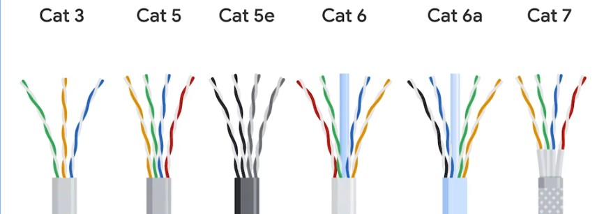
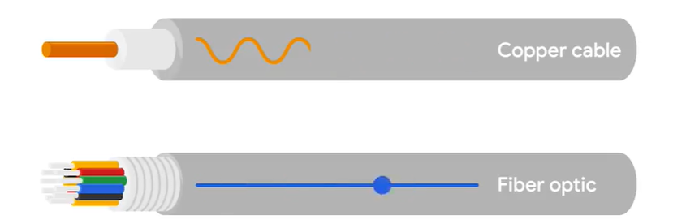
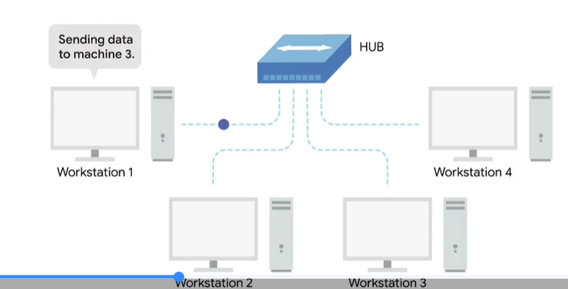
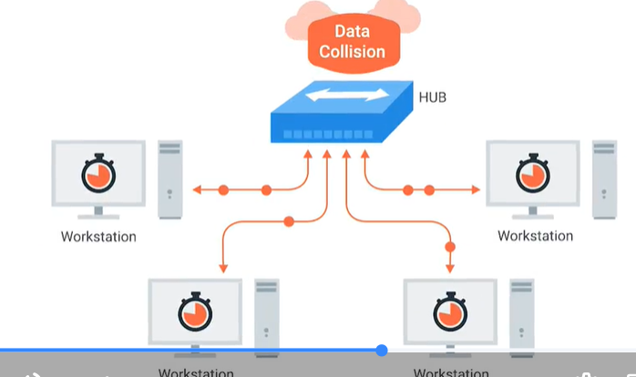
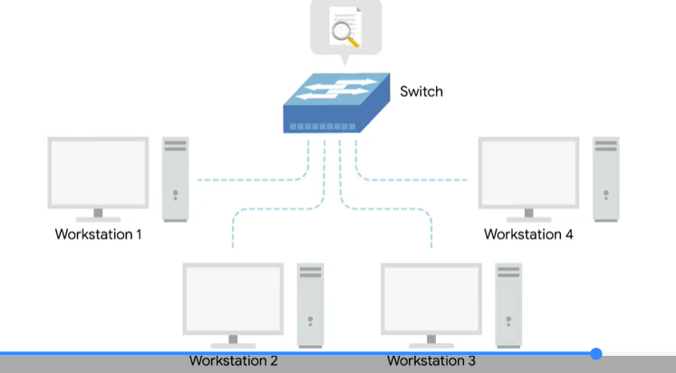
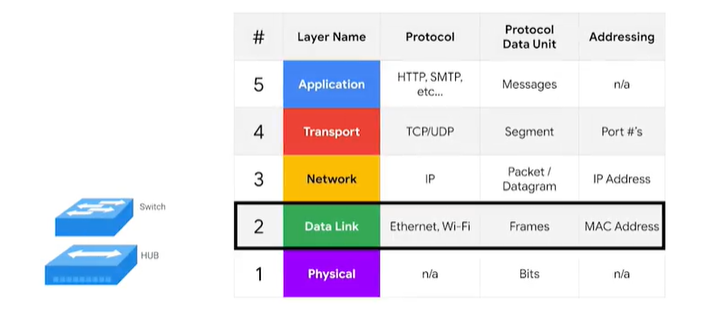
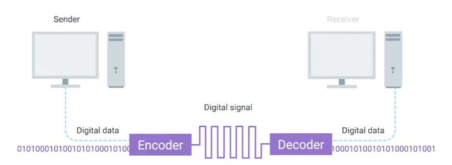
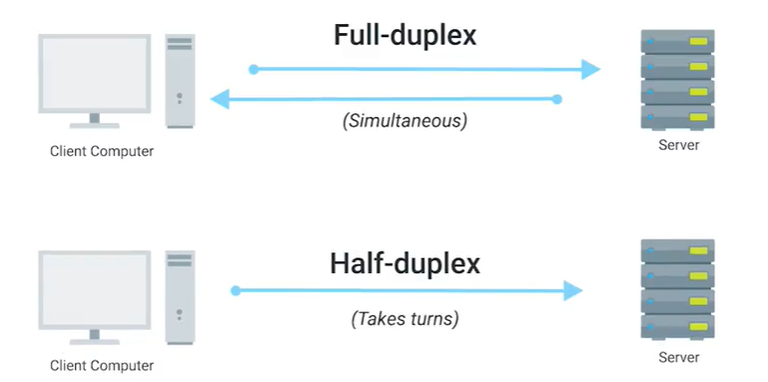

## Cables
Connect different devices to each other allowing data to be transmitted over them.

- copper - cate5, cate5e and cat6

- fiber - use light - cable made out of glass.

computers communicate in binary (0,1)

## Hubs
A Physical layer device that allows for connections from many computers at once. 

### Collision Domain
A network segment where only one device can communicate at a time.

If muliple systems try sending date at the same time, the electrical pulses sent across the cable can interfere with each other.

## Switch

A switch is very similar to a hub since you can connect many devices to it so they can communicate. The difference is that while a hub is a Layer 1 or physical layer device, a switch is a Layer 2 or datalink device. This means that a switch can actually inspect the contents of the Ethernet protocol data being sent around the network, determine which system the data is intended for, and then only send that data to that one system. This reduces or even completely eliminates the size of collision domains on a network. 

switch is a datalink layer device

- The Primary devices used to connect computers on a single network , usually refered to as a LAN or loal area network.

## Router 
A device that known how to forward data b/w independent networks. Router is a network layer device.

### Border Gateway protocol
Routers share date with each other via this protocol, which lets them learn about the most optimal paths to forward traffic.

## Physical Layer

A <b>bit</b> is the smallest representation of data that a computer understand : it's (1 | 0).

## Modulation (line coding)
A way of varying the voltage of this change moving across the cable. 

Twisted pair cable

## Duplex Commnication

The concept that information can flow in both directions across the cable.

- Full duplex
- Half duplex

- Simplex communication - This Process is unidirectional

## Straight-Through Cable

Used to connect different device types (computers/routers to hubs/switches).

**Computers and routers (send/receive):**
- Pins 1 & 2 - Orange wires (sending)
- Pins 3 & 6 - Green wires (receiving)

**Hubs and switches (send/receive):**
- Pins 1 & 2 - Green wires (sending)
- Pins 3 & 6 - Orange wires (receiving)

