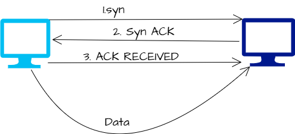

## Protocal
A defined set of standards that computers must follow in order to communicate properly.

## Computer Networking 
The name we're given to the full scope of how computers communicate with each other.

## OSI Model

| # | Layer name   | Protocol (examples)                 | Protocol Data Unit (PDU)            | Addressing (typical)                      |
|:--:|:-------------|:------------------------------------|:------------------------------------|:------------------------------------------|
| 7  | Application  | HTTP, FTP, SMTP, DNS                | Data                                | Application identifiers (URLs, email)     |
| 6  | Presentation | TLS/SSL, MIME                       | Data                                | N/A (handled at application level)        |
| 5  | Session      | NetBIOS, RPC, PPTP                  | Data                                | Session IDs / sockets                     |
| 4  | Transport    | TCP, UDP, SCTP                      | Segment (TCP) / Datagram (UDP)     | Port numbers (endpoints)                  |
| 3  | Network      | IP (IPv4/IPv6), ICMP                | Packet                              | IP addresses                              |
| 2  | Data Link    | Ethernet, PPP, ARP                  | Frame                               | MAC addresses (physical/Link-layer)       |
| 1  | Physical     | Ethernet PHY, DSL, RS-232 (examples)| Bits                                | Physical medium / electrical signals      |

## TCP Model

| # | Layer name   | Protocol (examples)                 | Protocol Data Unit (PDU)            | Addressing (typical)                      |
|:--:|:-------------|:------------------------------------|:------------------------------------|:------------------------------------------|
| 5  | Application  | HTTP, FTP, SMTP, DNS                | Messages                               | Application identifiers (URLs, email)     |
| 4  | Transport    | TCP, UDP, SCTP                      | Segment (TCP) / Datagram (UDP)     | Port numbers (endpoints)                  |
| 3  | Network      | IP (IPv4/IPv6), ICMP                | Packet / Datagram                             | IP addresses                              |
| 2  | Data Link    | Ethernet, PPP, ARP                  | Frame                               | MAC addresses (physical/Link-layer)       |
| 1  | Physical     | Ethernet PHY, DSL, RS-232 (examples)| Bits                                | Physical medium / electrical signals      |

### Physical Layer:-
Represents the physical devices that interconnect computers.

### Data Link Layer (Network interface / network access):-
Responsible for defining a common way to interpreting these signals so network devices can communicate.

-> The <b>Ethernet </b> standards also define a protocol responsible for getting data to nodes on the same network or link.

### Network layer:-
Allows different networks to communicate with each other through devices known as routers.

IP (Internet protocol) is the heart of the internet and most smaller network around the world.

### Transport layer:-
Sorts out which client and server programs are supposed to get that data.

TCP - Transmission control protocol

 - Connection Oriented protocol.
 - First acknowledge the session between the two computers that are communicating.
 - Two computers verify a connection before any communication take place.

 

 - Guarantess the delivery of the data.
 - If a data packet doesn't arrive then TCP will resend it.

