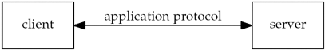
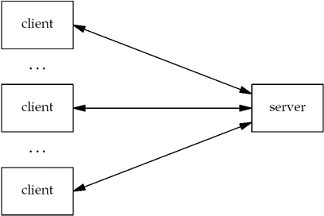

# SocketProgramming

## Protocol:- 
An aggreement on how programs(network programms) will communicate.

## WebServer:-
Webserver is typically throught of as along-running program(or daemon) that sends network messages only in response to request comming in from the network.

The other side of the protocol is a Web client, such as a browser, which always initiates communication with the server. 

This organization into client and server is used by most network-aware applications.

Deciding that the client always initiates requests tends to simplify the protocol as well as the programs themselves. Of course, some of the more complex network applications also require **asynchronous callback communication**, where the server initiates a message to the client. But it is far more common for applications to stick to the basic client/server model.

single client and server.

Server handling multiple clients at the same time.

The client application and the server application may be thought of as communicating via a **network protocol**, but actually, **multiple layers of network protocols are typically involved.**

